# PhotoEvent

Uma aplicação em Java para empresas de serviços visuais, como fotografia e filmografia, que ajuda a gerenciar eventos, pagamentos e tarefas de funcionários.

## Sumário
- [Sobre o Projeto](#sobre-o-projeto)
- [Funcionalidades](#funcionalidades)
- [Tecnologias Utilizadas](#tecnologias-utilizadas)
- [Screenshots](#screenshots)
- [Status do Projeto](#status-do-projeto)
- [Contato](#contato)

## Sobre o Projeto

Este projeto foi desenvolvido em Java, utilizando bibliotecas do Java Swing para a interface gráfica e MongoDB como banco de dados. O objetivo é fornecer uma solução para empresas de serviços visuais (fotografia e filmagem) que buscam gerenciar datas de eventos, pagamentos e a distribuição de tarefas entre os funcionários.

## Funcionalidades

- Cadastro e login de usuários controlados por um administrador.
- Gerenciamento de eventos e suas datas.
- Distribuição e visualização de tarefas por funcionário.
- Interface intuitiva para navegação.

## Tecnologias Utilizadas

- **Java**: Para a lógica da aplicação.
- **Java Swing**: Para a interface gráfica.
- **MongoDB**: Para armazenar os dados da aplicação.
- **IntelliJ IDEA**: IDE usada no desenvolvimento.
- **Canva**: Para esboço e construção de protótipos das telas.

 
 
 
 

## Screenshots

Adicione aqui capturas de tela da aplicação em funcionamento. Por exemplo:

### Tela Inicial
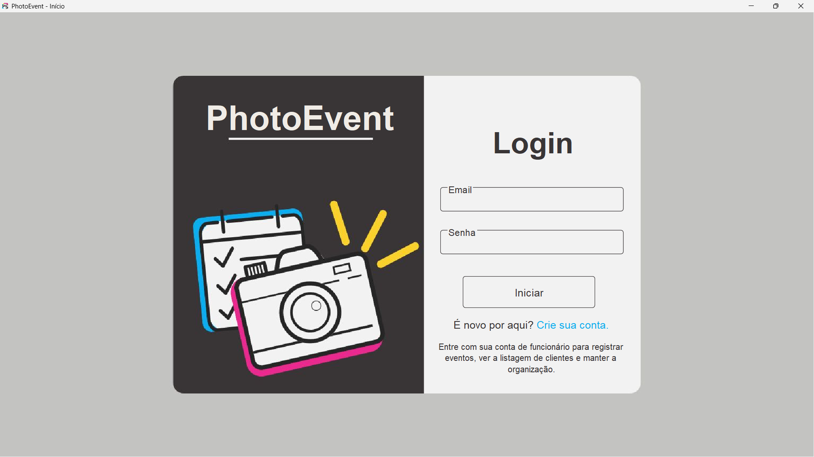

### Tela de Cadastro
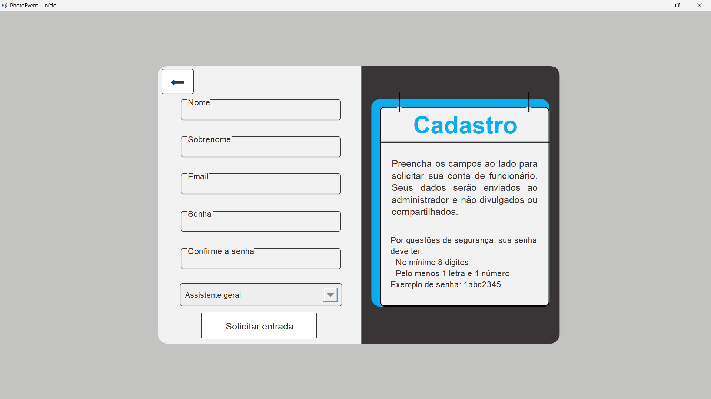

### Tela de menu do Administrador
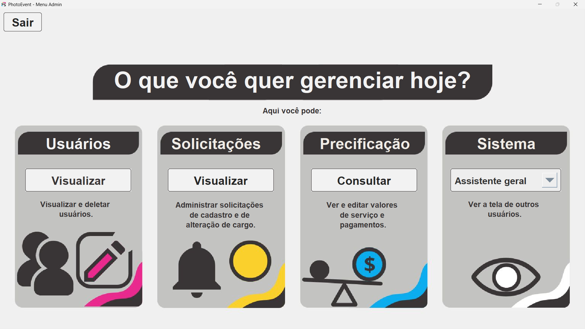

### Tela de visualização de usuários ativos
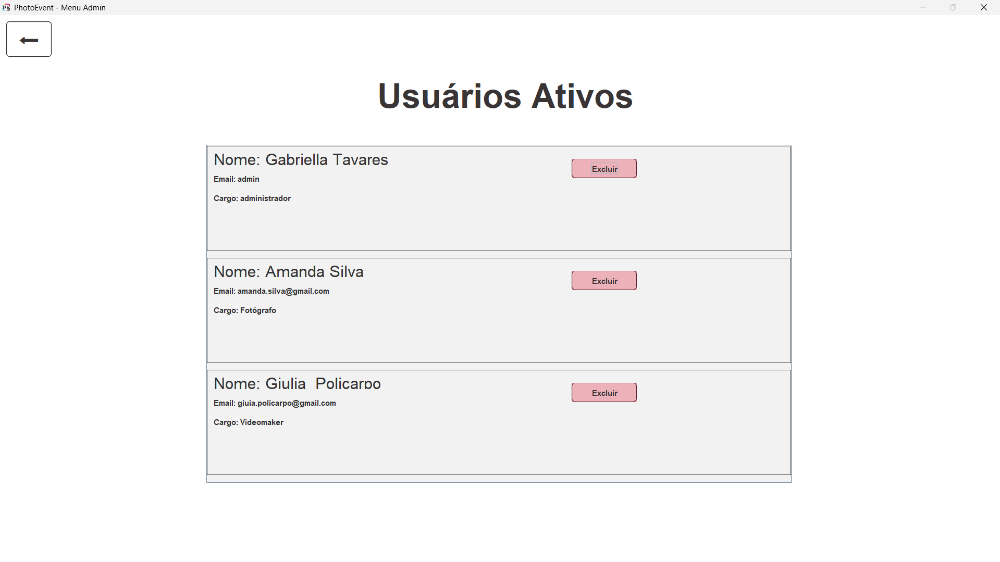

### Tela de Solicitações
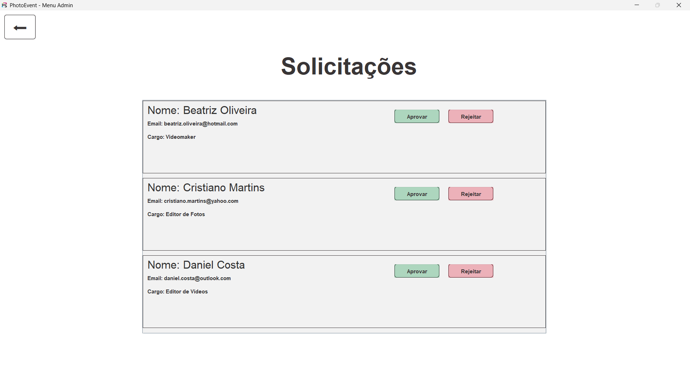

### Tela de Precificação
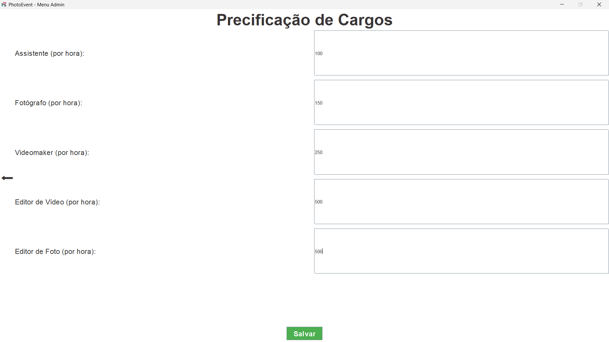

### Tela de visualização de usuários ativos

### Tela de menu do Assistente
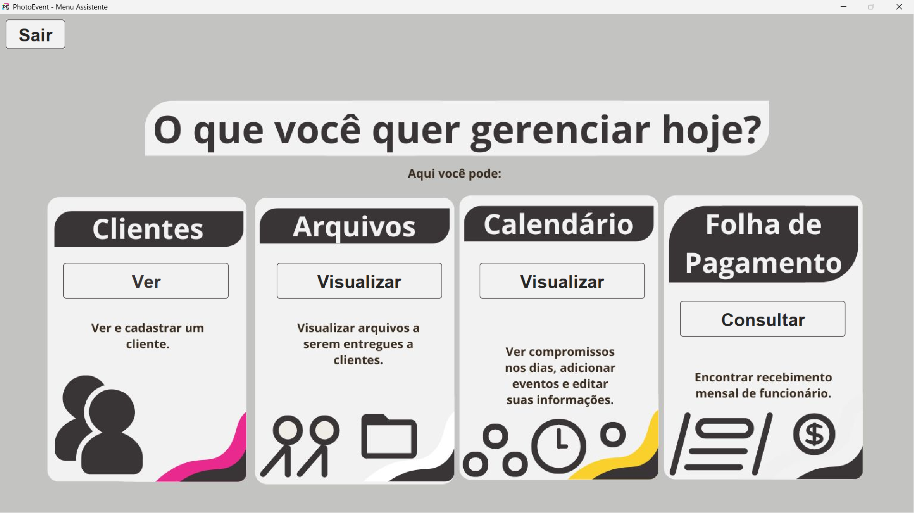

### Tela de visualização de clientes
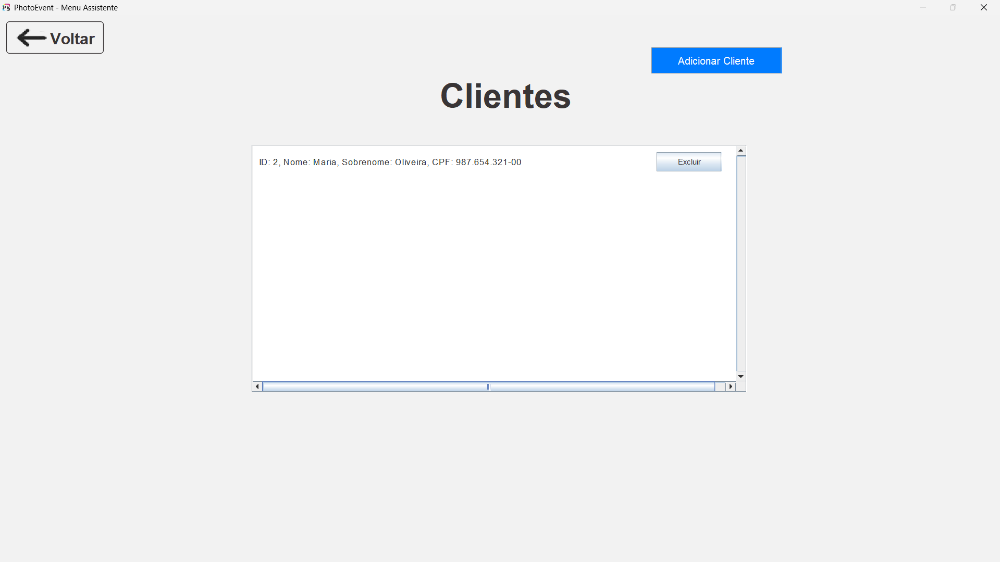

### Tela de visualização de arquivos
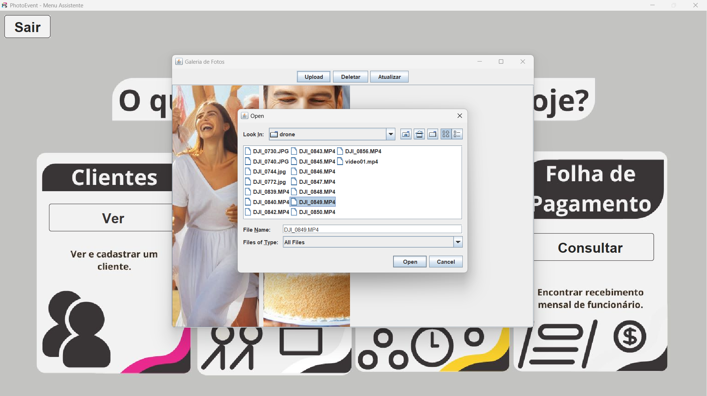

### Tela de visualização do Calendário
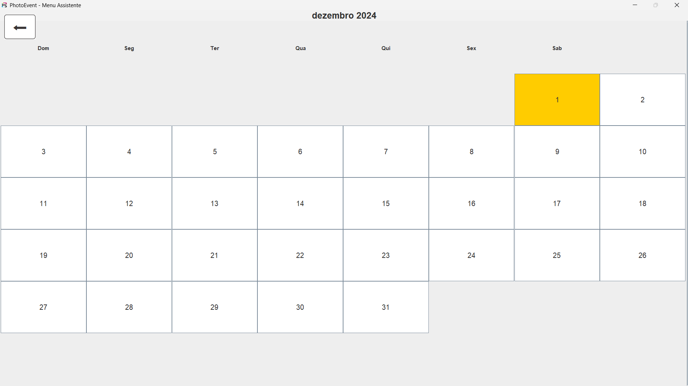

### Tela de criar evento
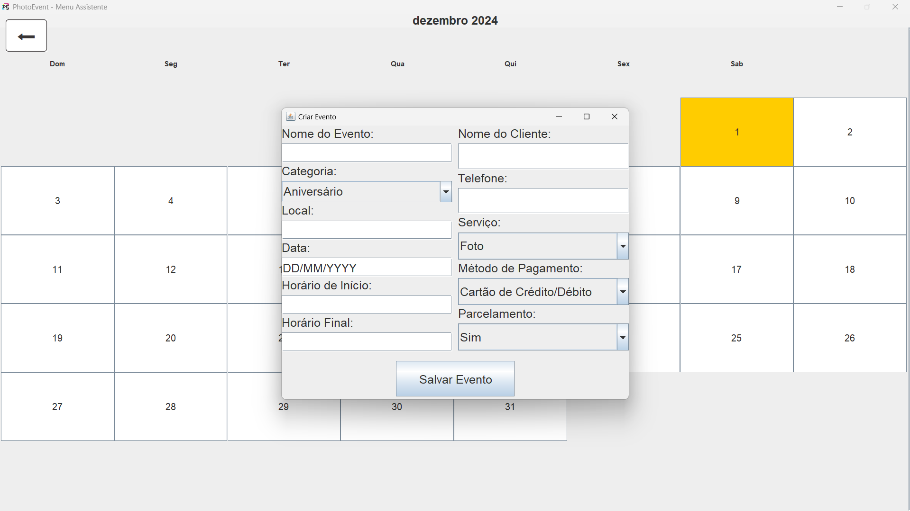

## Status do Projeto

Este projeto está em desenvolvimento e depende de configurações específicas no meu ambiente local para ser executado.  
Atualmente, não está preparado para ser utilizado ou testado por terceiros.

## Contato

Desenvolvido por Gabriella - [LinkedIn](https://www.linkedin.com/in/gabriellatccorrea/)
